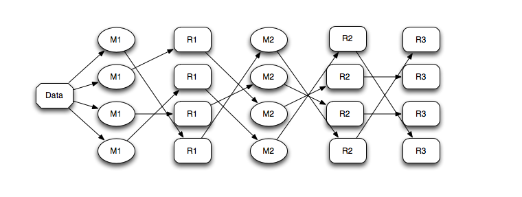
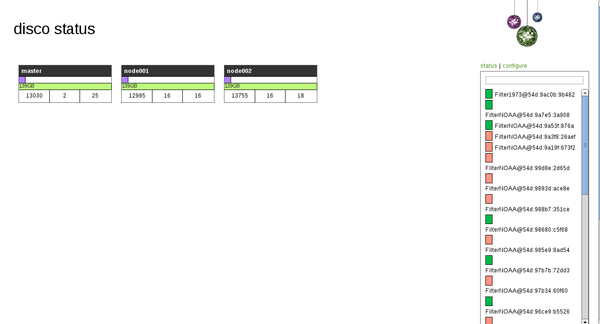
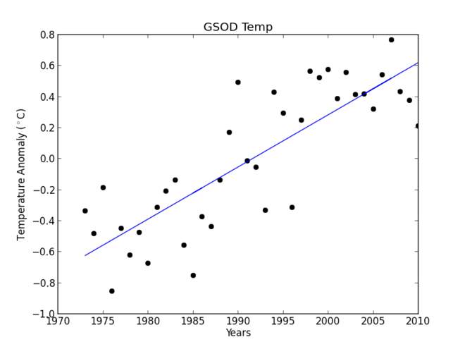

out of core
node 
machine code
evolving
http://www.epcc.ed.ac.uk/wp-content/uploads/2011/11/VinaySudhakaran.pdf
http://scienceblogs.com/deltoid/2012/12/12/sea-level-rise-acceleration/
http://arxiv.org/pdf/1207.6002.pdf

Managing Large Datasets and Computation Workflows with Disco and Blaze
======================================================================
     

- Benjamin Zaitlen
	- Continuum Analytics

---

MapReduce With Disco
============================

- Developed at Nokia
- MapReduce Implementation written in Python and Erlang 
- Scalable Distributed Computation
- Useful for Processing Big Data
- http://discoproject.org/

---

Map Reduce Background
============================
- **Map** Data: (key,value) pairs to buckets.  
- **Partitioning** define how keys move to buckets
- **Reduce** process data in buckets with the same key
- *Repeat if necessary*

.notes: These are my notes, hidden by default

---

Disco Distributed Filesystem (DDFS)
===================================

- Tag Based System 
	- Data, URL, S3, etc. 
- Chunked or Whole File
- Horizontally Scalable

---

Disco Web Interface (DDFS)
===================================

---

Example: Hello Weather 
============================
- Daily Recordings of a Surface Data
	- 10000+ Weather Stations
	- Data Store: [FTP](ftp://ftp.ncdc.noaa.gov/pub/data/gsod/readme.txt)
- Data Contents: 
	- Average: Temperature, Dew Pt,Pressue, Wind Speed, etc
	- Max/Min: Temperature
	- Totals: Precipitation, Snow Depth
- Data Hierarchy:
	- Year->File
	- 1981/227100-99999-1981.op.gz (WMO-WBAN-Year.op.gz)

---

Global Temperature Anomaly 
============================

---

Map Step
==================================

- Goal: Generate average temperatures per year across many stations
- Map dates and station IDs

        !python
		@staticmethod
	    def map(WeatherDateStat, params):
	        date = WeatherDateStat.split('/')[....#get date
	        yield (date, WeatherDateStat)

---

Reduce Function Part 1
==================================
- Modules are imported in each function.  No Globals.

		!python
		@staticmethod
		def reduce(StatIDs, out, params):
		    from disco.util import kvgroup
		    import numpy as np
		    import ftplib
		    import iopro
		    
		    for date, WeatherDateStat in kvgroup(sorted(StatIDs)):
		        ftp = ftplib.FTP('ftp.ncdc.noaa.gov')
		        ftp.login()

---

Reduce Function Part 2
==================================
- Compute average of several stations across a given year

		!python

	        avg_temp = np.empty(0)
	        
	        for file in WeatherDateStat:
	            cache = open(file.split('/')[-1],'wb')
	            
	            ftp.retrbinary("RETR " + file, cache.write, 8*1024)
	               
	            cache.close()
	            adapter = iopro.text_adapter(cache.name,...)
	            avg_temp = np.concatenate((avg_temp,adapter[:]['TEMP']))

	        out.add(date, (avg_temp.mean(),avg_temp.std() ) )

---

NOAA Data is Messy
============================
- Incomplete Dates

- Missing Values/9999.9

- Stations Don't Persist

---

Chaining Jobs
=============

---

Chaining Jobs (cont.)
=====================

- Filter list of stations in 1973 

- Filter list of stations which persist

- Pass list to original job

---

MapReduce Final Thoughts
========================
- Data cleansing - no one wants to talk about it but it's everyone's pain point

- Framework which invites thinking about how tasks can be broken up
	- good for code management 
	- hides -- in a good-way -- data management

- Can be inefficient
	- Be aware of overheard
	- Job Organization 

---

Blaze
=====
- Next generation of NumPy
- Handles out-of-core computations on large datasets.
- *Will* handle data from multiple sources and filesystems
- http://blaze.pydata.org/

---

Blazing NOAA
=============
	!python
	from blaze import Table, mean, std, params, select, open
	from blaze.algo.select import select2

	adapter = iopro.text_adapter('noaa_gsod_example.op',...)

---

Blazing NOAA (cont.)
====================
	!python
    if not os.path.exists('./noaa_data'):
        p = params(clevel=5, storage='./noaa_data')

        t = Table([], dshape='{f0: int, f1:int, f2:int, f3:float}', \
        			params=p)

        t.append(adapter[:])
        t.commit()
    else:
        t = open('ctable://noaa_data')

   	mean(t, 'TEMP')
   	std(t, 'TEMP')
   
	qs1 = select(t, lambda x:  20120131 > x > 20110101, 'YEARMODA')
	
	mean(t[qs2],'TEMP')

---

Blaze Future 
============

	!python
	t = open('ctable://noaa_data')
	t = open('http://...')
	t = open('ftp://...')
	t = open('hdfs://...')
	t = open('ddfs://...')
	...

---

Closing Thoughts
================

- MapReduce (Disco)
	- Easy To Break up work
	- Distribute Computation
	- Distribute Data

- Blaze
	- Empower Domain Expert
	- Empower Algorithm Designers
	- Empower Parallelism Researchers
		

.notes: algo: Optimizations for  data: type, shape, and layout. Parallel-explore data and task parallelism

---

Thank You!
==========
- Blaze
	- http://blaze.pydata.org/
- Disco
	- http://discoproject.org/
- Continuum
	- http://continuum.io/
	